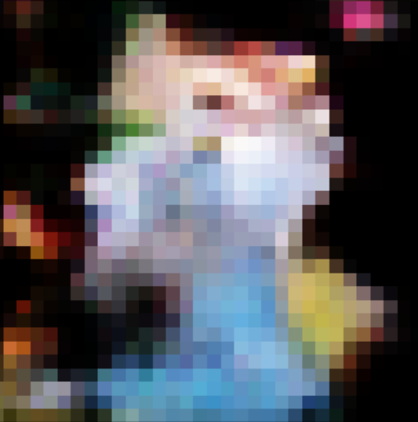

# DCGAN Implementation

DCGAN uses convolutional and convolutional-transpose layers in the generator and discriminator, respectively. The input image is of dimensions 32x32x3. The output image is also a 32x32x3 image. This project uses a Gen1 Pokemon dataset of about 10,000 images for training.

The implementation was done on Google colab. Images were downloaded on to google drive and subsequently used in the notebook. 

Refer  ``` training_code.ipynb``` for codes related to training the model, and plotting results, ```dataloader.py``` for data preprocessing steps(remove incompatible images), ```model.py``` for Discriminator and Generator classes and their architecture.


## Sample generated Pokemon Image:



## Install Requirements:
For installing the requirements for this software, please run the following: 

 ```
 pip install -r requirements.txt
 ```
  

## Dataset
https://www.kaggle.com/datasets/thedagger/pokemon-generation-one